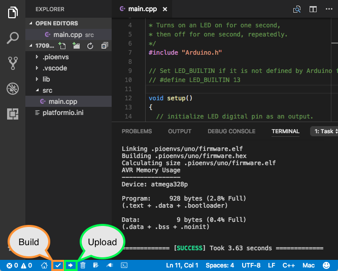

# Drone Launcher

A platform for launching drones remotely.


## Install

### Your Computer

1. **Platformio**


    Platformio is used to compile and flash code to the teensy. The easiest way to obtain Platformio is though their vscode exstension.

2. **TeensyDuino**


    Teensy duino is used to flash code to the teensy. For instructions see here [LINK](https://www.pjrc.com/teensy/td_download.html). If you are on a standard computer with amd64 architecture the following should work:

    ```bash
    wget https://downloads.arduino.cc/arduino-1.8.15-linux64.tar.xz
    wget https://www.pjrc.com/teensy/td_154/TeensyduinoInstall.linux64
    wget https://www.pjrc.com/teensy/00-teensy.rules
    sudo cp 00-teensy.rules /etc/udev/rules.d/
    tar -xf arduino-1.8.15-linux64.tar.xz
    chmod 755 TeensyduinoInstall.linux64
    ./TeensyduinoInstall.linux64 --dir=arduino-1.8.15
    cd arduino-1.8.15/hardware/teensy/avr/cores/teensy4
    make
    ```

3. **ROS1**

    The odroid is running a ROS1 master that you can connect to. For this you will need a ROS1 version. Preferably melodic since the odroid is running that, however I have found noetic to work as well. For instructions see the offical [ROS website](http://wiki.ros.org/ROS/Installation). You also need to install these dependencies:

    ```
    sudo apt install ros-<YOUR DISTRO>-rosserial-python ros-<YOUR DISTRO>-rosserial-client
    ```

4. **Clone**

    Clone this repository into at ROS workspace ("catkin_ws"). This is bacuse this repository contains custom ROS messages that needs to be built.

5. **Static IP**

    Connect to the Drone Launcher we need to use the Rajant Radios. For this we need to specify a static ip. This IP should be in the in the form *192.168.12.69*. If it is not this specific IP you need to update the *connect_odroid_ros_master.bash* script with your ip. Depending on your OS the process will be different for achiveing this. I used ```nm-connection-editor```.

## Odroid C2

    Inside the launcher there is a Odroid C2 which needs to be configured.

1. **Ubuntu mate**
    Ubuntu mate 18.04 is used as OS. This is provided by Odroid. See instructions here: [LINK](https://wiki.odroid.com/odroid-c2/getting_started/os_installation_guide?redirect=1). You can find the os image here: [LINK](http://de.eu.odroid.in/ubuntu_18.04lts/C2/).

2. **Static IP**
    
    It is required for the Odroid to have a Static IP for the Rajant Mesh radio. If you have a screen connected you can use ```nm-connection-editor    ```. The IP should be *192.168.12.168*. If this is not the IP then several scripts might not work.

3. **ROS1**

    The odroid also needs to have ROS1 installed. If you installed ubuntu mate 18.04 you need to install ROS melodic. If you installed 20.04 it should be ROS noetic. See instructions above for how to install it. You also need to install these dependencies:

    ```
    sudo apt install ros-<YOUR DISTRO>-rosserial-python ros-<YOUR DISTRO>-rosserial-client
    ```

4. **Clone**

    The odroid also need to have this repository to work. Clone it into the foler `catkin_ws/src`. You can copy your repo over to the odroid by running: ```./scripts/copy_files_and_compile_odroid.sh```. The script will ask you for the password of the odroid a few times. The file transfer and compile will take some time.

5. **Flash code from Odroid (Optional)**

    It is possible to flash code to the Teensy from the Odroid. This makes it so that you do not have to open the launcher and connect your computer to the Teensy to flash new code. The odroid is able to pull changes from git, compile and flash the code. To do this you need to install Platformio and TeensyDuino on the Odroid as well. The prosess is similar, however we do not want the platformio exstension in vs-code. We want platformio-core only.

    You can try the *scripts/install.sh* script for installing everything on the odroid. However, keep in mind that this script is not really tested and I have had issues with installing TeensyDuino headless. Also notice that the Odroid C2 has an Aarch64 architecture and NOT am64. Therefore, the install script downloads *.linuxaarch64 and not linux64 or similar.

    ```bash
    # Make sure you are in the root directory of this repository.
    mkdir build
    ./scripts/install.sh build/
    ```
    I had two problems doing this. Firstly you need to add platformio to path. Add this line to you ~/.bashrc file: "export PATH=$PATH:/home/odroid/.platformio/penv/bin". Furthermore, I had issues installing teensyDuino. Try installing it using the gui by removing the --dir flag. Run ```./TeensyduinoInstall.linuxaarch64``` instead of ```./TeensyduinoInstall.linuxaarch64 --dir=arduino-1.8.15```.

6. **Build**
    It is necessary to build the custom ROS messages. Run:

    ```bash
    # Build catkin pkg
    catkin build
    source devel/setup.bash
    ```

4. **Drone Launcher Service**
    
    To make sure that the Odorid connects to the Teensy serial port using Rosserial on startup I have used a systemd service. The service is located in *scripts/drone_launcher.service*. We need to copy this file to the correct location and enable the service. This can be done as follows:

    ```terminal
    cp scripts/drone_launcher.service /etc/systemd/system/drone_launcher.service
    systemctl start drone_launcher.service
    systemctl enable drone_launcher.service
    ```

    You can verify that the service is running using ```systemctl status drone_launcher.service```.

    Furthermore, we should set up propper logging


## Run

### Your computer

1. **Build ROS pkg**
    We need to build our custom messages. This is done using ```catkin build``` (catkin_make should also work). Then you need to source your workspace, run: ```source devel/setup.bash``` After that we need to make header files for the messages that the Teensy will have acceess to. ```rosrun rosserial_client make_libraries <GIT_REPO_DIR>/embedded_sw/lib drone_launcher_pkg```

3. **Flash code to Teensy**
    Open a vscode window in the *embedded_ws/* folder. If platformio is installed correctly you should then see some new optinon in the bottom menu bar. After connecting the Teensy to you computer you can press the upload arrow to compile and flash code to the Teensy. See picture.

    <div align="center">
    
    <br>
    <figcaption align="center">Platformio Build and Upload</figcaption>
    </div> 

4. **Connect to Odroid**
    After you have flashed code to the Teensy and setup the Odroid we are ready to connect to it. Make sure you are connected to a Rajant mesh radio. Firstly verify that you are able to connect to the Odroid by pinging: ```ping 192.168.12.168```. If this is succesfull you can connect to the ROS master running on the odroid by sourcing the *scripts/connect_odroid_ros_master.bash*: ```source scripts/connect_odroid_ros_master.bash```. If you now run ```rostopic list``` you should see some */dronelauncher/** topics appear. 

5. **Sending ROS messages**
    You can send ROS messages to the Odroid using standard ```rostopic pub /drone_launcher/<topic> <type> <data>```. Auto complete with tab is your firend with these commands. Make sure to source the catkin workspace if you want to read the custom status messages the Odroid sends out. 