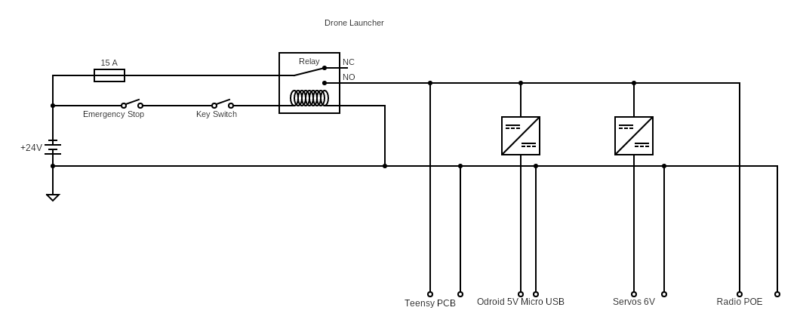

# Drone Launcher Electronics

This folder contains all the Schematics and PCB designs for the drone launcher. KiCAD has been used to make these. Please [download](https://www.kicad.org/download/) it to view these files. 

## Description

### Logic Connections

There are two processing units in the drone launcher: Teensy 4.1 and Odroid C2. These two communicate over serial using a micro USB cabel. The Odroid is also connected to a Rajant radio using an ethernet cabel. The Teensy is placed on a PCB which connects it to all the peripherals.

List over PCB connections:
- Limit Switches (labeled BTNS FxRx)
- Led Dtrip Drone Indicator (labeled LED DRONE)
- Arming Switch (labeled ARM SW)
- Menu Buttons (labeled MENU BTNS)
- Led Strip Battery Indicator (labeled LED BAT)
- PWM Servo Signals (labeled SERVO Fx)
- GPS connector (labeled GPS)
- LCD connector (labeled LCD)
- IMU connector (labeled IMU)

Please refere to the pcb schematic to figure out the pinouts of the different connectors.

### Power Connections

A 6s LiPo battery is used to power the system. This power goes though a 15 A fuse and a Relay. The Relay coil is connected to a emergency stop button and a key switch. If any of these are not turned no the system will not have any power. After going though the relay the power is distributed to the different devices. 

**Power Devices:**
- Teensy PCB, connect battery to XT60 plug
- Odorid, 5V@2A needed, connect micro usb plug from switching regulator
- Rajant Radio, PoE 8-60V?, connect ethernet cabel to battery voltage
- Servos, 6V, use step down regulators to provide power

    

        
         
        <figcaption align="center">Diagram of power circuit</figcaption>
    
 
