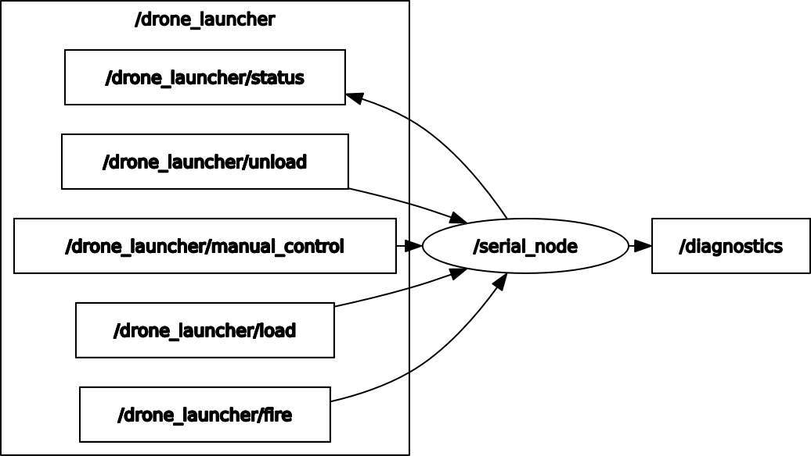

# Drone Launcher Code

# Description

The Majority of the software is running on the Teensy. The Odroid is mainly used for communication over the Rajant Radios. The Sowtware running on the micro controller is divided into these main modules:

- **Communicator**

    This module is responsible for the communication with the odroid over rosserial. It sends status messages to the odroid and recieves commands sent over ROS. 

- **Menu**

    This module controls the LCD display and handles the logic for the menu. If the user selects an action on the menu the module will forward this information to the Launch System module.

- **Launch System**

    This module controls all the Launch Units (all "chambers"). The module contains several instances of the Launch Unit class and calls the relevant fire, load or unload commands when the user calls these commmands.

- **Battery Monitor**

    This is a small Module that reads the voltage from the battery and sends this information to the communicator.

- **Navagator**
    This module is responsible for giving informatio about the location and orientation of the launcher. This is done by reading the data from a GPS and a IMU. 

All of these modules has their own init functio that needs to be called at the beginning of the program as well as a update function that should be run periodically. 


# ROS Interface

<div align="center">
    
    <br>
    <figcaption align="center">Visualization of ROS topics for drone launcher</figcaption>
</div> 


Here is a list over all the topics related to the Drone Launcher:

- **fire**

    This topic is used to send fire commands to the Drone Launcher. The datatype is `std_msgs/UInt8`, where the number relates to a launchUnit Id. The drone launcher will not fire if the launch unit is not loaded or system is not armed.

- **status**

    Sends status information about the dronelauncher. The datatype is a custom `drone_launcher_pkg/LauncherStatus`. See the definition of the message or use ```rosmsg show drone_launcher_pkg/LauncherStatus``` for more information. The status is sent a 1 Hz.

- **manual_control**

    Used to overwrite all safety mechanisms and to manualy control all servo motoros. The topic is ment to be used if something is not working correctly and you need to overwrite the positions of the servos. The datatupe is a custom `drone_launcher_pkg/ManualControl`. It contains a launch unit Id for indexing the launch units. It also contains a safetyServoOn and triggerServoOn bool variables. If these are set to true the safety will be on and the trigger will be in loaded position. If they are false then the safety will be off and the trigger will be in release position.

- **load**

    Not really used. You should use the menu when loading drones. The datatype is `std_msgs/UInt8`, where the number is the launch unit Id that should be loaded. Notice that you cannot specify the drone Id, therefore it defaults to 0.

- **unload**

    Not really used. You should use the menu when unloading drones. The datatype is `std_msgs/UInt8`, where the number is the launch unit Id that should be unloaded. 
